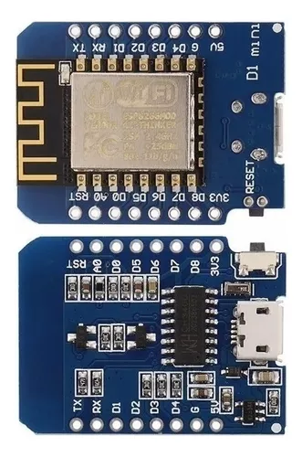
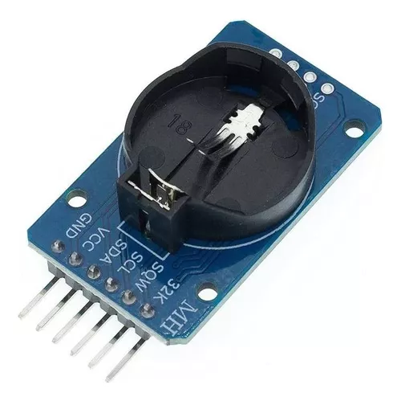
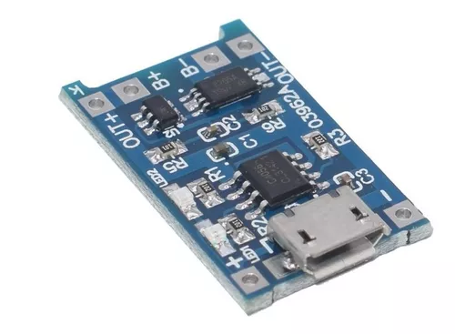
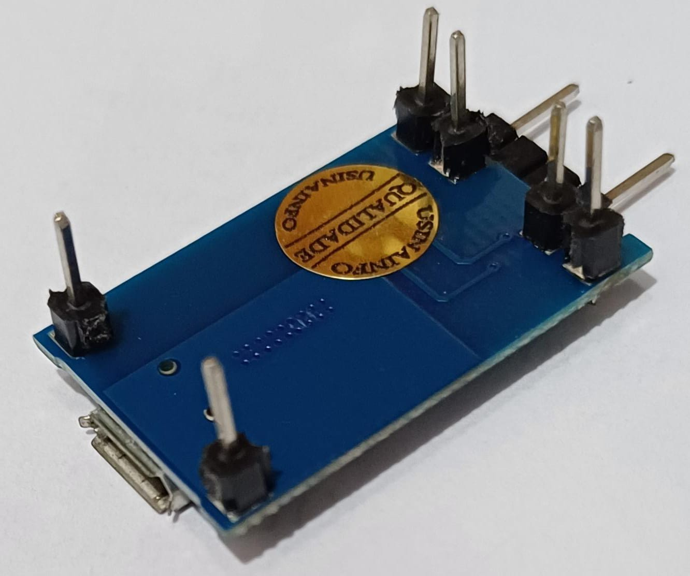
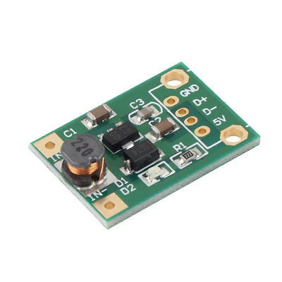
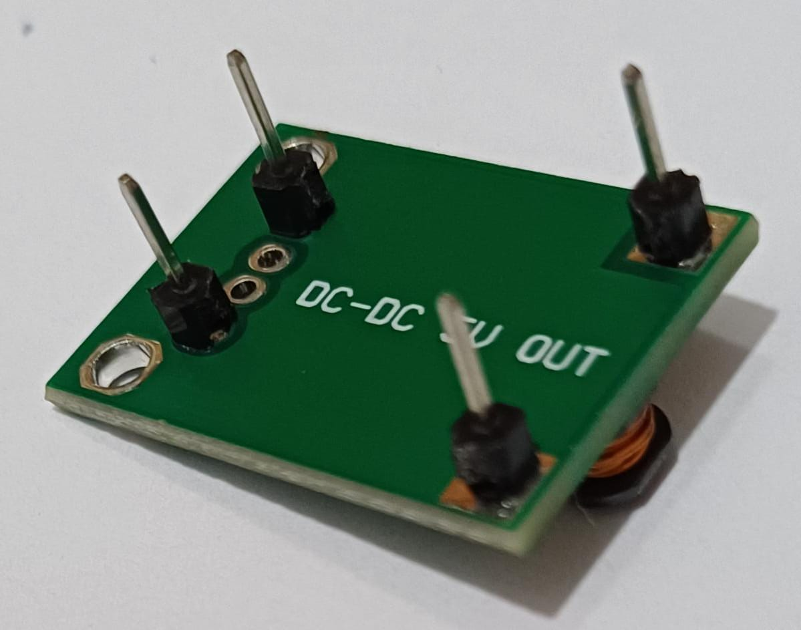
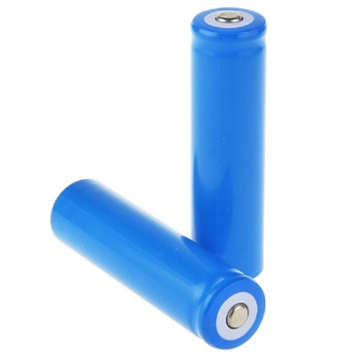
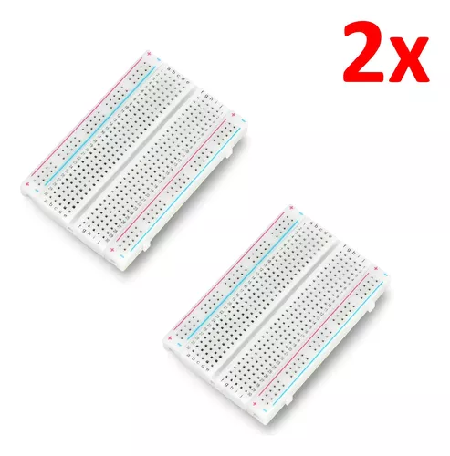

          

# ESP8266 Pomodoro AWS Alexa

## Justificativa
**Este projeto foi criado para fins didáticos** e mostra a integração de várias tecnologias para obter um **IoT** funcional. 
Desenvolver um temporizador Pomodor para usar no trabalho, com temporizadores pré-programados para a academia, controlado por botões e pela Alexa, alimentado por baterias recarregáveis. Os dados de tempo dos exercícios e do trabalho devem ser enviados para a AWS e verificados em um dashboard

## Introdução
usando Wemos D1 Mini Nodemcu ESP8266,
Display de sete segmentos Tm1638,
Relógio interno Rtc3231 sincronizado por NTP
Bateria íon-lítio, 
sincronizando com AWS usando Flask e apresentando um dashboard com Streamlit
___

## Índice 
[Etapas](#ancora0)
[Componentes utilizados](#ancora1)
[Bibliotecas utilizadas](#ancora2)

___

## Etapas

| Etapa                             |                              Status                              |
| :-------------------------------- | :--------------------------------------------------------------: |
| Descrição do projeto              |     |
| Construção do circuito eletrônico |  |
| Programação para Tm1638           |  |

## Componentes utilizados.
   

### Wemos D1 Mini Nodemcu Esp8266

   

### Display Tm1638 7 Segmentos 8x7 Led&key

   

### Módulo Real Time Rtc Ds3231

   

### Carregador De Bateria Lítio Tp4056

Pinos soldados para uso no protoboard.

   

### DC-DC Boost Converter Step Up Module

Pinos soldados para uso no protoboard.

   

### Bateria recarregável de lítio 18650

   

### 2x Protoboard 400 Pontos

[Índice](#ancora)
   

## Bibliotecas

[Índice](#ancora)

