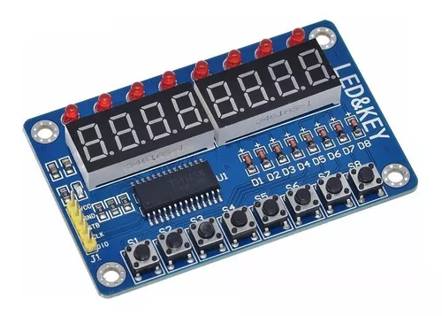

 

# ESP8266 Pomodoro AWS Alexa
**Este projeto foi criado para fins didáticos** e mostra a integração de várias tecnologias para obter um **IoT** funcional. 

## Justificativa

Relógio e Temporizador Pomodoro usando Wemos D1 Mini Nodemcu Esp8266,
Display de sete segmento Tm1638,
Relógio interno Rtc3231 sincronizado por  NTP
Bateria íon-lítio, 
sincronizando com AWS usando Flask e apresentamdo um dashboard com Streamlit
___

## Indice 
[Apresentação dos componetes utilizados](#ancora1)

___

## Apresentação dos componetes utilizados.

### Wemos D1 Mini Nodemcu Esp8266

### Display Tm1638 7 Segmentos 8x7 Led&key

### Módulo Real Time Rtc Ds3231

[Indice](#ancora)