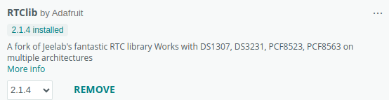

            

# ESP8266 Pomodoro AWS Alexa

## Justificativa
**Este projeto foi criado para fins didáticos** e mostra a integração de várias tecnologias para obter um **IoT** funcional. A segunda justificativa é que, particularmente, eu quero um bom temporizador pomodoro, com um cronômetro para academia e que seja prático de usar.

## Objetivo
Desenvolver um temporizador multipropósito:
- Pomodoro para usar no home-office ou para estudo.
- Temporizadores pré-programados para exercícios na academia.
- Controlado por botões e pela Alexa.
- Alimentado por baterias recarregáveis. 
- Os dados de tempo dos exercícios e do trabalho devem ser enviados para a AWS e verificados em um dashboard

## Introdução
Usando Wemos D1 Mini Nodemcu ESP8266,
Display de sete segmentos Tm1638,
Relógio interno Rtc3231 sincronizado por NTP
Bateria íon-lítio, 
sincronizando com AWS usando Flask e apresentando um dashboard com Streamlit

## Índice 
[Etapas](#ancora0)
[Componentes utilizados](#ancora1)
[Bibliotecas utilizadas](#ancora2)
[Circuito montado no Protoboard](#ancora3)

## Etapas

| Etapa    |  Status  |
| :--------| :------: |
| Descrição do projeto              |   |
| Construção do circuito eletrônico no protoboard|  |
| Programação para Tm1638           |  |
| Programação para Rtc3231          |  |
| Programação para mostrar data e hora|  |
| Programação para Temporizador Pomodoro         |  |
| Detecção da carga da bateria       |  |
| Programação para WPS              |  |
| Programação para NTP              |  |
| Programação para Alexa            |  |
| Programação para Flask            |  |
| Programação para Streamlit        |  |
| Deploy para AWS                   |  |
| Testes e ajustes                  |  |
| Desenho do circuito eletrônico    |  |
| Desenho da placa de circuito impresso|  |
| Confecção da placa e soldagem dos componentes |  |
| Testes e ajustes finais           |  |
| Divulgação do trabalho            |  |

 

## Componentes utilizados.
 

### Wemos D1 Mini Nodemcu Esp8266

### Display Tm1638 7 Segmentos 8x7 Led&key

### Módulo Real Time Rtc Ds3231

### Carregador De Bateria Lítio Tp4056

Pinos soldados para uso no protoboard.

### DC-DC Boost Converter Step Up Module

Pinos soldados para uso no protoboard.

### Buzzer Ativo 5v

### Transistor BC 548
 

### Resistores 4k7, 47k e 100k por 1/4W (pode ser 1/8W)

### Bateria recarregável de lítio 18650

### 2x Protoboard 400 Pontos

[Retornar para o Índice](#ancora)
   

## Bibliotecas

https://github.com/dvarrel/TM1638

https://github.com/adafruit/RTClib

https://github.com/arduino-libraries/NTPClient

[Retornar para o Índice](#ancora)
   

## Circuito montado no Protoboard

[Retornar para o Índice](#ancora)